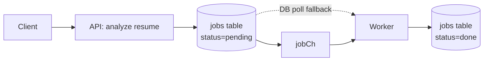
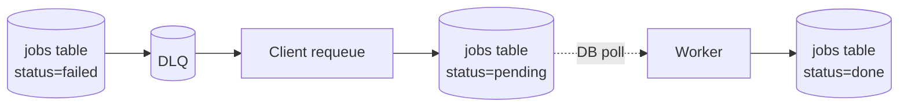

# Jatify - Job Application Tracker

### Main Feature
- Job Application Tracking
- AI Resume Analyzer with Open Router's Model
- Job Queue System for Resume Analysis with DLQ fallback implementation
- Concurrent Job Processing for Resume Analysis

### Repository's Architecture
Implemented using clean architecture principles, emphasizing on separation of concerns using different types of layers. In general, there are **four** layers
| Layer Name | Responsibilities |
| -----------|-------------------|
| Handler Layer | HTTP Request Validation, Request Processing  |
| Service Layer | Main Business Process |
| Repository Layer | Interacting with database or anything data related |
| Entity Layer | Struct, Data definition across other layers |

### Visualization of The Architecture

## Job Queue Design
Note that the term "Job" here is not the actual Job as in the main Job Application Feature. In this section, "Job" term is defined as an object that needed to be processed for the 
AI Resume analyzer. 
# Enqueue & Requeue Flow
The Job Queue sytem is designed with concurrency, utilizing the go routine feature from Go. Right now, the concurrent workers are hardcoded into three workers only.
In a nutshell, this three workers will "race" to find the next "Job" available. The next job available are defined as follows

- The latest channel input if any 
- The latest pending job in the database
## Enqueue

## Requeue (from DLQ)

