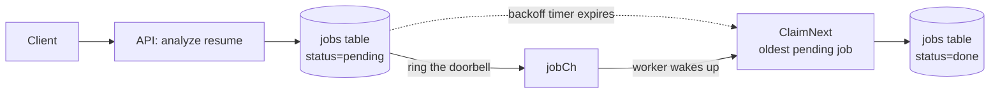
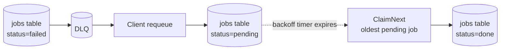
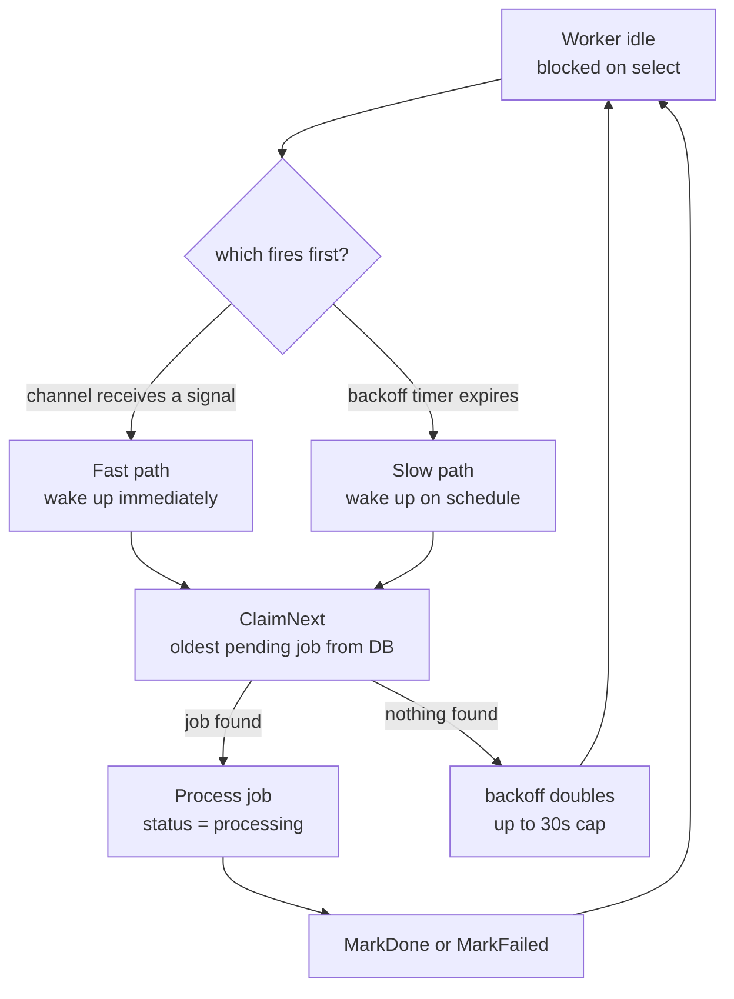

# Jatify - Job Application Tracker

### Main Feature
- Job Application Tracking
- AI Resume Analyzer with Open Router's Model
- Job Queue System for Resume Analysis with DLQ fallback implementation
- Concurrent Job Processing for Resume Analysis

### Repository's Architecture
Implemented using clean architecture principles, emphasizing on separation of concerns using different types of layers. In general, there are **four** layers
| Layer Name | Responsibilities |
| -----------|-------------------|
| Handler Layer | HTTP Request Validation, Request Processing  |
| Service Layer | Main Business Process |
| Repository Layer | Interacting with database or anything data related |
| Entity Layer | Struct, Data definition across other layers |

### Visualization of The Architecture

## Job Queue Design
Note that the term "Job" here is not the actual Job as in the main Job Application Feature. In this section, "Job" term is defined as an object that needed to be processed for the 
AI Resume analyzer. 
# Simplified Enqueue & Requeue Flow
The Job Queue sytem is designed with concurrency, utilizing the go routine feature from Go. Right now, the concurrent workers are hardcoded into three workers only.
In a nutshell, this three workers will "race" to find the next "Job" available. The next job available are defined as follows

- The latest pending job in the database

Every /enqueue calls will populate a channel. A channel input would wake one of N (3 for now) concurrent workers to do the process. The process will claim the next Job i.e the latest pending jobs in the database

## Enqueue

## Requeue (from DLQ)

---

## How the Worker Wakeup Works

---

## Glossary

| Term | What it does |
|---|---|
| **jobCh** | Buffered channel (cap 30). Acts as a doorbell — populated on enqueue, discarded by worker. Purely a wakeup signal, not a data queue. |
| **Fast path** | Worker woken by a channel signal. Goes straight to `ClaimNext()`. |
| **Slow path** | Worker woken by backoff timer expiring. Also goes to `ClaimNext()`. Safety net for missed signals (channel full, requeue, crash recovery). |
| **ClaimNext** | Atomically grabs the oldest `pending` job (`ORDER BY created_at`), flips it to `processing`. Uses `FOR UPDATE SKIP LOCKED` so concurrent workers never claim the same job. |
| **Backoff** | Each worker's poll interval. Starts at 1s, doubles on empty poll, caps at 30s. Resets to 1s when a job is found. Prevents idle workers from hammering the DB. |
| **DLQ** | Dead Letter Queue. Permanently failed jobs land here. Requeue flips the original job back to `pending` — no channel signal sent, worker discovers it via slow path. |
| **FIFO** | Enforced by `ClaimNext` alone. Channel ID is always discarded — both paths go through DB, so queue order is never bypassed. |

